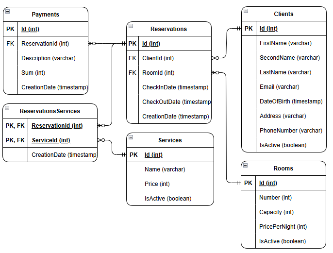
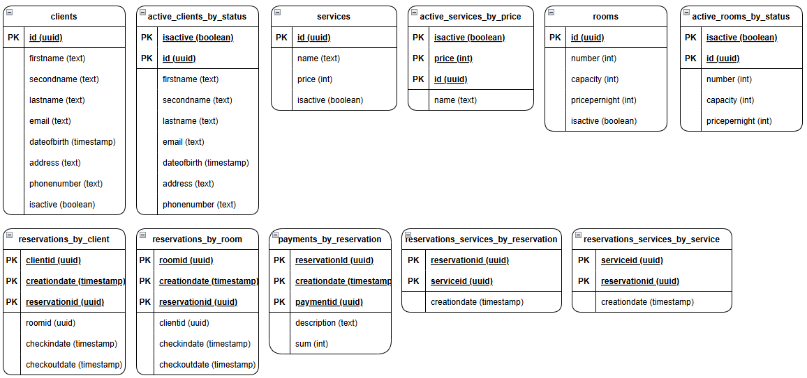
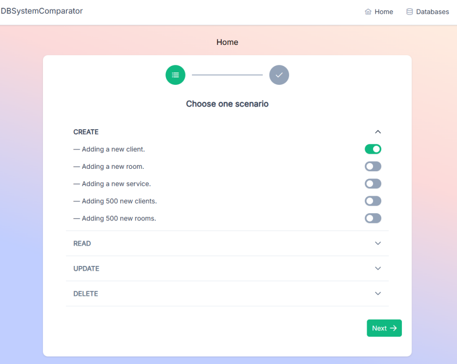
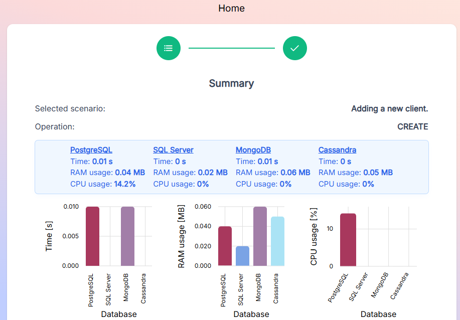

# DBSystemComparator

## About project
The project aims to compare four popular database management systems in terms of their practical application. The analysis evaluates the performance of CRUD operations in relational systems such as PostgreSQL and Microsoft SQL Server, as well as in non-relational solutions including MongoDB and Apache Cassandra. The study focuses on comparing data processing efficiency, scalability capabilities, and security levels. The analyzed scenario is based on a hotel room reservation system operating on large datasets. As part of the project, a data model reflecting the structure of such a system was designed. A dedicated test application was also developed to perform CRUD operations in an automated and repeatable manner. Tests conducted for different data volumes made it possible to evaluate execution time, resource consumption, and the scalability of each solution.

## Technologies
### Web application
- Framework
    - Angular
- Languages
    - TypeScript
    - HTML
    - CSS
- Key Features
    - Reactive Extensions (RxJS)
    - Notifications
    - Bar charts (ngx-charts)
    - API communication
- Component library
    - PrimeNG
- Application styling
    - Tailwind CSS

### System server
- Framework
    - ASP.NET Core Web API
- Language
    - C#
- Key Features
    - REST API
    - Dependency Injection, DTO, Controller, Service and Repository patterns
    - Application's seeder during the initial launch

### Databases:
- PostgreSQL
- Microsoft SQL Server
- MongoDB
- Cassandra

## Roles in the application
- Guest

## Databases schema

### PostgreSQL

### Microsoft SQL Server

### MongoDB

#### Clients
| Pole        | Typ      |
|------------|----------|
| _id        | ObjectId |
| firstName  | String   |
| secondName | String   |
| lastName   | String   |
| email      | String   |
| dateOfBirth| Date     |
| address    | String   |
| phoneNumber| String   |
| isActive   | Boolean  |

#### Rooms
| Pole           | Typ      |
|---------------|----------|
| _id           | ObjectId |
| number        | Int32    |
| capacity      | Int32    |
| pricePerNight | Int32    |
| isActive      | Boolean  |

#### Services
| Pole     | Typ      |
|----------|----------|
| _id      | ObjectId |
| name     | String   |
| price    | Int32    |
| isActive | Boolean  |

#### Reservations
| Pole         | Typ |
|--------------|-----|
| _id          | ObjectId |
| client       | Obiekt (Clients) |
| room         | Obiekt (Rooms) |
| checkInDate  | Date |
| checkOutDate | Date |
| creationDate | Date |
| services     | Tablica obiektów (Services) |
| payments     | Tablica obiektów (Payments) |

### Cassandra

## Main functions
- **Guest**:
    - Checking CRUD operations
    - Viewing data counts
    - Generating random data for databases

## System presentation
Data counts:

Data generation:

Scenario selection:

Summary of CREATE operation:

Summary of READ operation:

